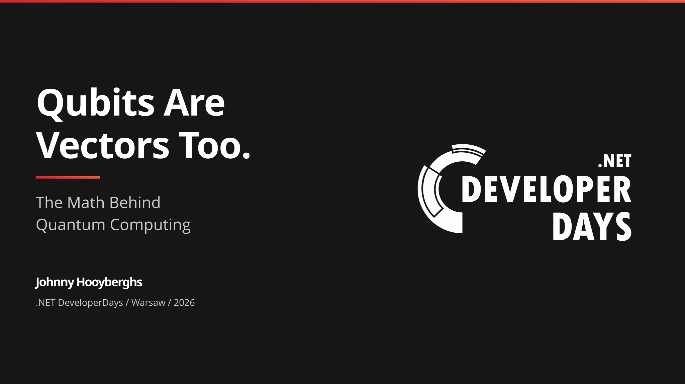
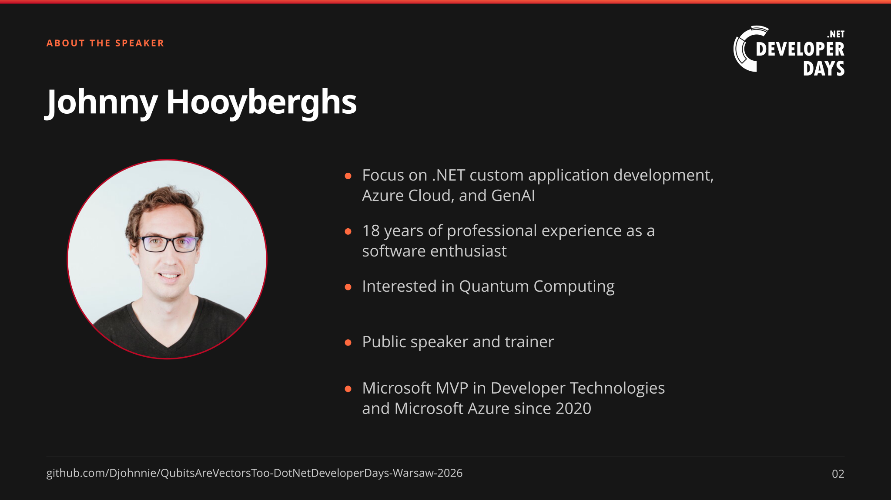
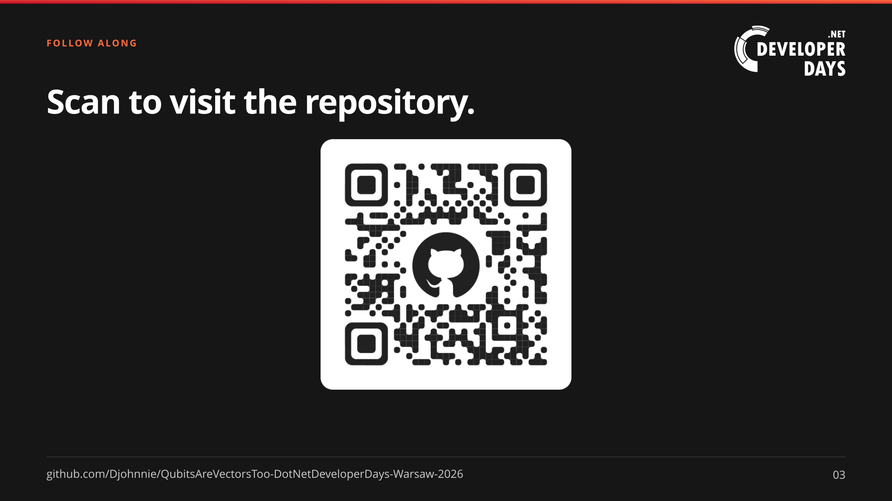
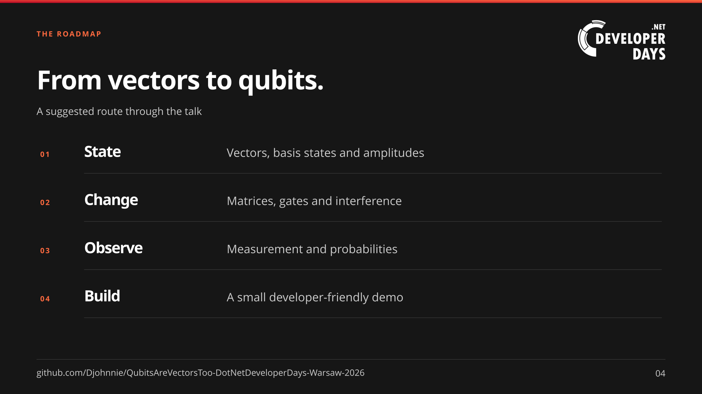
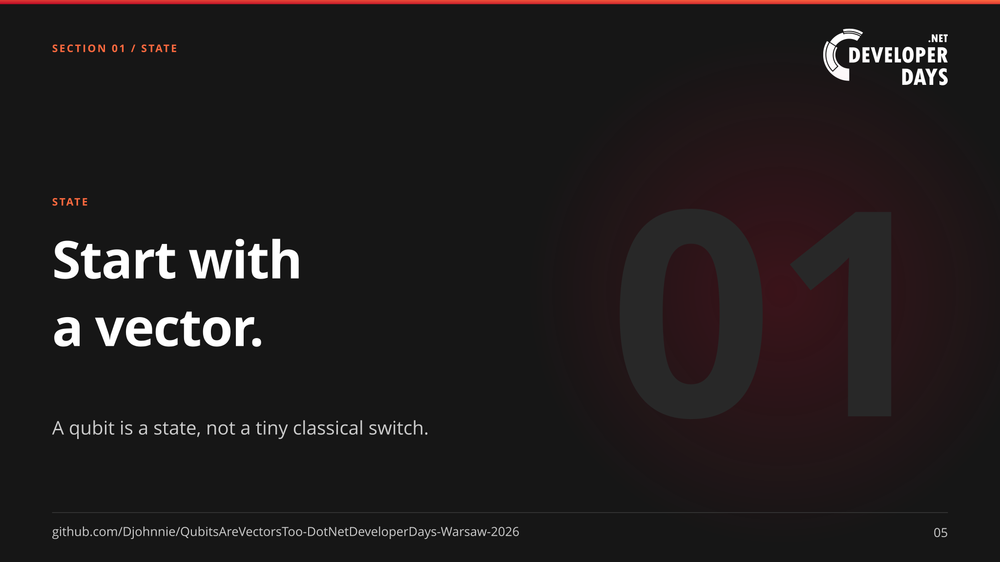
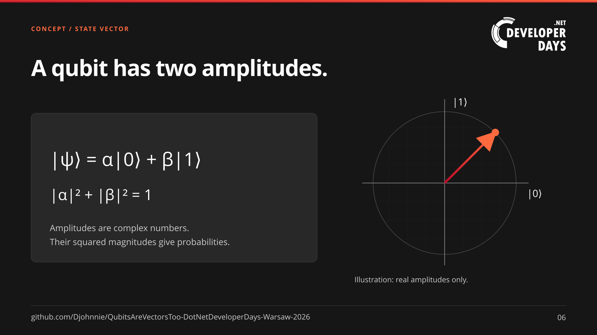
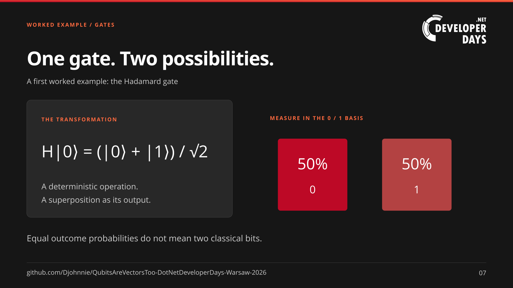
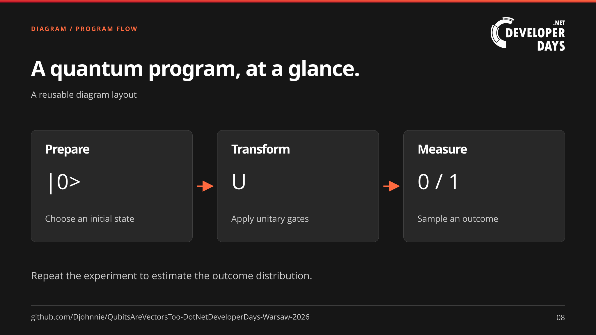
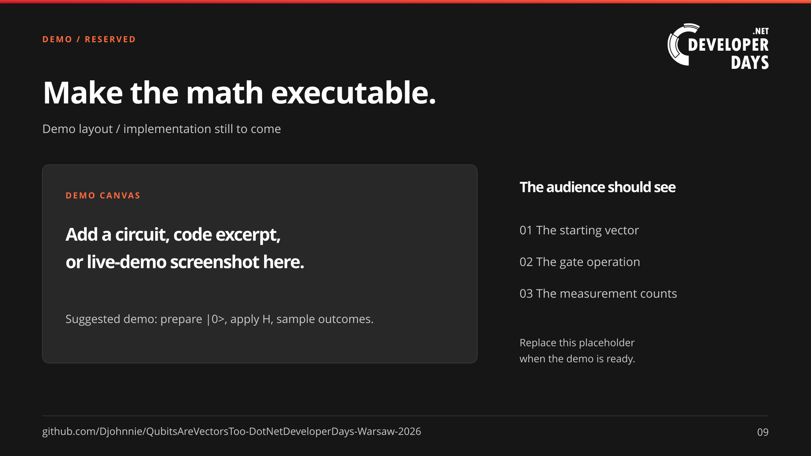
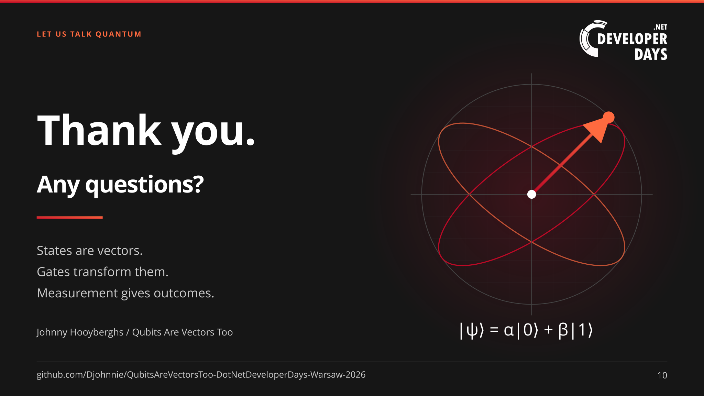

# Qubits Are Vectors Too

**The Math Behind Quantum Computing / .NET DeveloperDays Warsaw 2026**

A starter slide deck, not a finished talk. It includes an opening sequence,
suggested roadmap, sample quantum content, reusable layouts, and an explicitly
reserved demo slide.

Build the PowerPoint with
[`_tools\svg_to_pptx.ps1`](_tools/svg_to_pptx.ps1); it writes
`QubitsAreVectorsToo-DotNetDeveloperDays-Warsaw-2026.pptx` at the repository
root. Or open [`_slides\index.html`](_slides/index.html) locally for an
offline, keyboard-navigable preview. The
[blank content template](_slides/slide-template.svg) is ready to duplicate.

## Structure and editing

Based on the SVG-first organization of
[Cloud-Native Superpowers Using Orleans](https://github.com/Djohnnie/CloudNativeSuperpowersUsingOrleans-DotNetAssemble-2026):
numbered SVGs in `_slides`, a separate template, a root-level PowerPoint, and
publishing tools in `_tools`.

- `_slides\slide-NN.svg`: portable slides with embedded fonts and conference logo.
- `_slides\slide-template.svg`: reusable content layout, excluded from export.
- `_resources\`: fonts and notices, conference logo, speaker photo, QR code,
  and GitHub icon.
- `_tools\build-slides.ps1`: shared theme, layout helpers, and slide content.
- `_tools\svg_to_pptx.ps1`: dependency-free Windows PowerPoint exporter using Edge.

Edit the generator and rebuild, or work directly on copies of the SVGs.
The PowerPoint uses full-slide images, matching the reference deck's export
approach; its text and shapes are **not individually editable**.
Slides 2–10 have a linked repository caption and a slide number in the footer;
the title slide has no footer. Links are available in the SVG preview but are
not interactive in the image-based PowerPoint.
See [presentation tools documentation](_tools/README.md) for commands and details.

## Presentation slides

### Slide 1 / Title

The session title and presenter, with the enlarged .NET DeveloperDays logo
on the right. The logo identifies the conference; it is not an official
organizer-provided template.

### Slide 2 / About the speaker

Johnny Hooyberghs's speaker photo and professional background, adapted from
slide 2 of the [Cloud-Native Superpowers presentation](https://github.com/Djohnnie/CloudNativeSuperpowersUsingOrleans-DotNetAssemble-2026).

### Slide 3 / Presentation downloads

A centered QR code links directly to this GitHub repository. The SVG also
wraps the code in a clickable link.

### Slide 4 / Roadmap

A suggested narrative: state, change, observe, build.

### Slide 5 / Section divider

A reusable chapter opener: start with a vector.

### Slide 6 / Concept and formula

A normalized qubit state with complex amplitudes. The diagram deliberately
shows only a real-amplitude slice; it is not a Bloch sphere.

### Slide 7 / Worked example

Applying Hadamard to the zero state gives equal computational-basis outcome
probabilities. This is starter content, ready to expand into a derivation.

### Slide 8 / Diagram

A three-stage layout: prepare, transform, measure.

### Slide 9 / Demo placeholder

Reserved space for a future demo; no runnable quantum example is included yet.

### Slide 10 / Closing

Questions and three takeaways.

## Theme and asset credits

The visual direction comes from the
[.NET DeveloperDays Warsaw website](https://developerdays.eu/warsaw/):
near-black and charcoal surfaces, white headings, gray body text, crimson
accents, warm-orange highlights, and restrained rounded panels.

| Token | Value |
|---|---|
| Background / surface | `#161616` / `#282828` |
| Heading / body | `#ffffff` / `#cccccc` |
| Primary / link | `#bd0926` / `#df1238` |
| Secondary / border | `#ff6a3f` / `#444444` |
| Website primary gradient | `#bd0926` to `#b34242` |
| Deck accent gradient | `#bd0926` to `#ff6a3f` |
| Headings | Raleway, 700 |
| Body | Open Sans, 400 / 700 |

The deck adapts the website's palette rather than copying its page layout.
Vector illustrations and slide compositions are original.

The .NET DeveloperDays logo is sourced from the site's
[white logo asset](https://developerdays.eu/warsaw/wp-content/uploads/2026/01/net_dd_white.png).
It remains the property of its owner; its inclusion identifies the conference
and does not make this an official organizer-provided template.
The speaker photo in `_resources\speaker-photo.jpg` is adapted from
[`_slides\trainer-photo.jpg`](https://github.com/Djohnnie/CloudNativeSuperpowersUsingOrleans-DotNetAssemble-2026/blob/main/_slides/trainer-photo.jpg)
in the Cloud-Native Superpowers presentation. The QR code in
`_resources\qrcode.svg` points to this repository. These third-party assets
remain subject to their owners' rights; the repository's `LICENSE` does not
relicense them.

Fonts are distributed under the SIL Open Font License. Their notices are in
[`_resources\fonts`](_resources/fonts), alongside the font files from Google Fonts:
[Open Sans](https://fonts.google.com/specimen/Open+Sans) and
[Raleway](https://fonts.google.com/specimen/Raleway).
